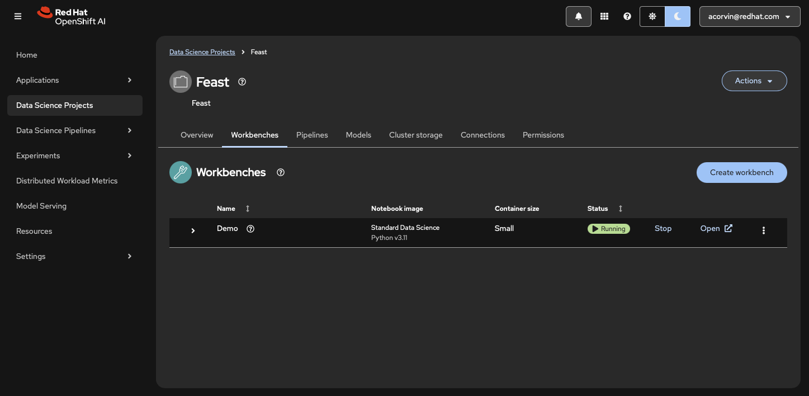
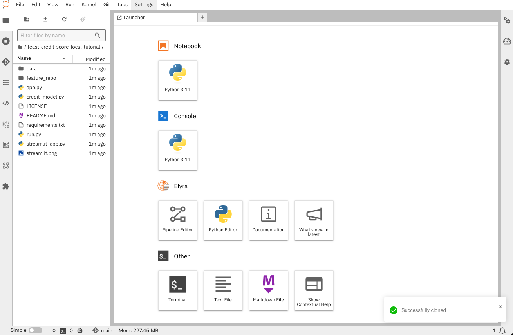

# Feast Customer Demo

## Prerequisites

You'll first need to [install the OpenShift oc client](https://docs.openshift.com/container-platform/4.18/cli_reference/openshift_cli/getting-started-cli.html#installing-openshift-cli) to be
able to run the command contained in this document.

We'll run this demo from an OpenShift AI Workbench (Jupyter notebook). As such, we need to
[install OpenShift AI](https://docs.redhat.com/en/documentation/red_hat_openshift_ai_self-managed/2-latest/html/installing_and_uninstalling_openshift_ai_self-managed/configuring-custom-namespaces#installing-the-openshift-data-science-operator_operator-install)
on the cluster and enable the dashboard and workbenches components.

You can apply the following DataScienceCluster custom resource to
enable just the required components of OpenShift AI:

```
cat <<EOF | oc apply -f -
apiVersion: datasciencecluster.opendatahub.io/v1
kind: DataScienceCluster
metadata:
  name: default-dsc
  namespace: redhat-ods-operator
  labels:
    app.kubernetes.io/name: datasciencecluster
    app.kubernetes.io/instance: default-dsc
    app.kubernetes.io/part-of: rhods-operator
    app.kubernetes.io/managed-by: kustomize
    app.kubernetes.io/created-by: rhods-operator
spec:
  components:
    codeflare:
      managementState: Removed
    kserve:
      nim:
        managementState: Removed
      serving:
        ingressGateway:
          certificate:
            type: OpenshiftDefaultIngress
        managementState: Removed
        name: knative-serving
      managementState: Removed
    modelregistry:
      registriesNamespace: rhoai-model-registries
      managementState: Removed
    trustyai:
      managementState: Removed
    ray:
      managementState: Removed
    kueue:
      managementState: Removed
    workbenches:
      managementState: Managed
    dashboard:
      managementState: Managed
    modelmeshserving:
      managementState: Removed
    datasciencepipelines:
      managementState: Removed
    trainingoperator:
      managementState: Removed
EOF
```

For the purposes of the demo, we will also update the RHOAI dashboard
deployment to deploy only a single pod (the default is 5), therefore reducing the compute resource requirements:

```
oc patch deployment/rhods-dashboard -n redhat-ods-applications --patch='{"spec": {"replicas": 1}}'
```

Finally, we'll programmatically create an OpenShift AI project to house the demo workbench and feature store instance:

```
cat <<EOF | oc apply -f -
apiVersion: v1
kind: Namespace
metadata:
  annotations:
    openshift.io/description: "Feast"
    openshift.io/display-name: "Feast"
  labels:
    kubernetes.io/metadata.name: feast
    opendatahub.io/dashboard: "true"
  name: feast
EOF
```

## Feast Operator Installation

Normally we will install the Feast operator via the ODH/RHOAI operator. For the purposes of this
demo, however, we want to use an unreleased version of the operator (to be able to use
the new feast Git init capabnility). We therefore need to run this command to
install a specific version of the Feast operator:

```
oc apply -f https://raw.githubusercontent.com/feast-dev/feast/refs/heads/0.47-branch/infra/feast-operator/dist/install.yaml
```

## Postgresql and Redis Setup

For this demo, we'll use a Postgresql instance for Feast's registry server and Redis for
Feast's offline server. Run the following to create the Postgresql and Redis instances and
associated services and secrets:

```
oc apply -f https://raw.githubusercontent.com/feast-dev/feast/refs/heads/0.47-branch/examples/operator-quickstart/postgres.yaml
oc apply -f https://raw.githubusercontent.com/feast-dev/feast/refs/heads/0.47-branch/examples/operator-quickstart/redis.yaml
```

## Feature Store Instance Creation

Next, we'll run the following command to create a Feature Store instance in the `feast` namespace.

```
oc apply -f https://raw.githubusercontent.com/feast-dev/feast/refs/heads/0.47-branch/examples/operator-quickstart/feast.yaml
```

This will initialize a feature store instance backed by ephemeral storage
and also clone the [Feast credit score tutorial](https://github.com/feast-dev/feast-credit-score-local-tutorial) into the Feature Store
to facilitate easily applying the Feature Store object definitions
required for the demo.

## Apply the Feature Store object definitions

At this point, the Feature Store object definitions (features, feature views, etc.) are represented on disk on the Feature Store pod, but they have not yet been applied to the running Feature Store
instance. In a future version of Feast, our operator will automatically apply these definitions, but for now you must manually run
the following command to apply them:

```
oc exec -n feast deploy/feast-example -itc online -- feast apply
```

You should see output similar to the following:

```
 oc exec -n feast deploy/feast-example -itc online -- feast apply
No project found in the repository. Using project name credit_scoring_local defined in feature_store.yaml
Applying changes for project credit_scoring_local
Deploying infrastructure for zipcode_features
Deploying infrastructure for credit_history
```

You can view the definitions for the objects that were created
[here](https://github.com/feast-dev/feast-credit-score-local-tutorial/blob/598a270353d8a83b37535f849a0fa000a07be8b5/feature_repo/features.py).

Finally, we can initialize the Feature Store's online store to ensure that is has the latest values for all features availble for on-demand querying:

```
oc exec -n feast deploy/feast-example -itc online -- bash -c 'feast materialize-incremental $(date -u +"%Y-%m-%dT%H:%M:%S")'
```

You should see output similar to the following:

```
% oc exec -n feast deploy/feast-example -itc online -- bash -c 'feast materialize-incremental 1970-01-00T00:00:00 $(date -u +"%Y-%m-%dT%H:%M:%S")'
Materializing 2 feature views to 2025-03-12 12:36:48+00:00 into the redis online store.

zipcode_features from 2015-03-15 12:36:50+00:00 to 2025-03-12 12:36:48+00:00:
100%|██████████████████████████████████████████████████████| 28844/28844 [00:01<00:00, 20941.25it/s]
credit_history from 2024-12-12 12:36:52+00:00 to 2025-03-12 12:36:48+00:00:
0it [00:00, ?it/s]
```

## Running the exmple training code from a workbench

Now that the Feature Store instance has been initialized and data has been
loaded into the online store, we're going to transition to working in an OpenShift AI workbench to interact with the Feature Store from a python environment.

First, within the `Feast` project that was created earlier,
[create a new workbench](https://docs.redhat.com/en/documentation/red_hat_openshift_ai_self-managed/2.17/html/working_on_data_science_projects/using-project-workbenches_projects#creating-a-project-workbench_projects). When creating the workbench, select the `Standard Data Science` notebook image. The image version and container size can be left at their default values. No data connection needs to
be created, and you can use the default option of creating new cluster storage
for the workbench.

**Important** Be sure to add the following environment variables when creating the workbench, as they
will be used to initialize the Feast SDK connection to the feature store endpoints. For this demo we'll
add the environment variables as key/value pairs in a ConfigMap. In a production setup, at a minimum the
password values should be pulled from a secret:

  * Key: `POSTGRES_HOST`, Value: `postgres.feast.svc.cluster.local`
  * Key: `POSTGRES_USER`, Value: `feast`
  * Key: `POSTGRES_PASSWORD`, Value `feast`
  * Key: `POSTGRES_DB`, Value: `feast`
  * Key: `REDIS_HOST`, Value: `redis.feast.svc.cluster.local`

Once the workbench has been started, open it in your brower by clicking on the link
from the OpenShift AI dashboard.



From within the running workbench, [clone the example repository](https://docs.redhat.com/en/documentation/red_hat_openshift_ai_self-managed/2-latest/html/working_in_your_data_science_ide/working_in_jupyterlab#collaborating-on-notebooks-by-using-git_ide)
by cloning the URL `https://github.com/accorvin/feast-credit-score-local-tutorial.git` then switching to the `demo`
branch (**Note** You may find it easier to change branches via the terminal in your notebook environment)

You should then see the contents of the Git repository in the file tree of your notebook environment:



Finally, install the python requirements then run the `run.py` script to execute the example.
The functionality can be viewed in the `demo_walkthrough.ipynb` notebook included
in the repository.

```
pip install --upgrade pip && pip install -r requirements.txt
python run.py
```